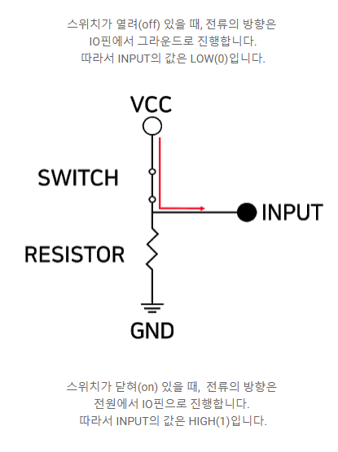

# cortex_STM32F103_Nucleo
> for cortex, stm32, nucleo study


#### 1. __attribute__와 weak

 - __attribute__((att1, att2, ...__))로 변수, 구조체, 함수의 선언시 특성 속성을 부여할 수 있다.
  - 이 중 weak의 특성은 컴파일 시 같은 이름의 weak 속성이 아닌 심볼(strong symbol이라 함)이 있을때 weak 속성의 심볼을 제거하고 weak가 아닌 것을 사용하는 것이다.
  - 예를 들면 weak 속성의 심볼은 정의 되지 않으면 컴파일 시 제거되어 오류를 검출하지 않으므로 소프트웨어 개발용 코드를 작성시에 함수를 weak 속성으로 선언하고 프로그래머가 직접 다른 파일에서 정의하도록 할 떄 사용할 수 있다.
  - 가장 큰 특징은 동일한 strong 심볼이 여러 개면 컴파일 오류가 발생하지만 weak심볼이 여러 개면 랜덤으로 선택된다.

  #### 2. Hal라이브러리에서 인터럽트의 발생 코드는 다음과 같다
  > EXT15_10_IRQHandler() -> HAL_GPIO_EXTI_IRQHandler() -> HAL_GPIO_EXTI_Callback()


```c
void EXTI15_10_IRQHandler(void)
  {
    	/* USER CODE BEGIN EXTI15_10_IRQn 0 */
    HAL_GPIO_EXTI_IRQHandler(GPIO_PIN_13);
    /* USER CODE BEGIN EXTI15_10_IRQn 1 */  
    }
```


  ```c
void HAL_GPIO_EXTI_IRQHandler(uint16_t GPIO_Pin)
{
  /* EXTI line interrupt detected */
  if (__HAL_GPIO_EXTI_GET_IT(GPIO_Pin) != 0x00u)
  {
    __HAL_GPIO_EXTI_CLEAR_IT(GPIO_Pin);
    HAL_GPIO_EXTI_Callback(GPIO_Pin);
  }
}
  ```

```c
__weak void HAL_GPIO_EXTI_Callback(uint16_t GPIO_Pin)
{
  /* Prevent unused argument(s) compilation warning */
  UNUSED(GPIO_Pin);
  /* NOTE: This function Should not be modified, when the callback is needed,
           the HAL_GPIO_EXTI_Callback could be implemented in the user file
   */
}
```

- 보이는 것처럼 call_back함수가 weak로 선언되어 있기 때문에 main에서 다시 정의해주면 된다

```c
void HAL_GPIO_EXTI_Callback(uint16_t GPIO_Pin){
	switch(GPIO_Pin){
		case B1_Pin:
			HAL_GPIO_TogglePin(LD2_GPIO_Port, LD2_Pin);
			break;

		default:
			;
	}
}
```


#### 3. EXTI(External Interrupt)

- 정확히 인터럽트는 외부와 내부 인터럽트로 구성되어 있다.
- 외부 인터럽트란 물리적인 인터럽트로 스위치를 예로 들 수 있고, 내부 인터럽트는 atmega실습에서 수행한 타이머 인터럽트를 들 수 있다.


#### 4. Watchdog Timer란

- 시스템이 무한루프나 비정상적인 동작을 하는 경우 자동으로 시스템을 리셋시키는 기능을 말한다.

- 여기에서 무한루프나 오류 등의 상황에 대하여 모니터링하는데 사용하는 타이머를 Watchdog 타이머라 한다.

  > 타이머를 맞추어 놓고, 계속 동작하면서 와치도그 타이머를 리셋시켜 와치도그 인터럽트가 발생되지 않도록 한다.
  >
  > 만약 시스템 내부적의 오류로 인해 와치도그 타이머를 리셋시키지 못해 인터럽트가 발생되면 프로그램에 문제가 생긴 것으로 간주하여 하드웨어적으로 리셋하게 되는 원리이다.


#### 5. RCC란 Reset Control Clock의 약자이다


#### 6. Auto-reload preload enable은 반복적인 작업이 발생하도록 하는 설정으로 일단 이해


#### 7. NVIC 

> Nested Vectored Interrupt Controller의 약자로, 중첩된 인터럽트를 제어하는 기능이다.

- 모든 exception에 대해서 우선순위가 설정되어 있고, 이 우선순위에 따라 interrupt를 처리하는데 의의가 있다.


#### 8. 다음과 같은 타이머 초기화 코드를 작성하면 이와 같은 코드가 main.c에 작성된다.

```c
  htim3.Instance = TIM3;
  htim3.Init.Prescaler = 63; //분주비
  htim3.Init.CounterMode = TIM_COUNTERMODE_UP; //timer 카운터 값이 올라감
  htim3.Init.Period = 999; //기간이지용
  htim3.Init.ClockDivision = TIM_CLOCKDIVISION_DIV1; 
  htim3.Init.AutoReloadPreload = TIM_AUTORELOAD_PRELOAD_ENABLE;
```


#### 9. Timer 중 LP가 붙은건 저전력 모드(low power)


#### 10. 마찬가지로 타이머 인터럽트가 발생하면 TIM3_IRQHandler() -> HAL_TIM_IRQHandler() -> HAL_TIM_PeriodElapsedCallback() 순서로 호출된다.


#### 11. volatile 변수로 선언한 변수는 사용할 때 항상 메모리에 접근하게 된다.


#### 12. ADC conversion에는 interrupt없이 하는 것이 regular conversion이고, conversion 도중에 다른 conversion이 생겨서 interrupt와 비슷하게 중간에 끼어 들어서 conversion이 가능한 것이 injected conversion이라고 생각하면 된다


#### 13. DMA(Direct Memory Access)란 cpu를 대신하여 I/O장치와 Memory사이의 데이터 전송을 담당하는 장치를 지칭한다.

- CPU의 개입 없이 주변장치와 주기억장치와의 데이터 전송이 이루어지는 방법을 통칭
- 프로그램 수행 중 입출력을 위한 인터럽트의 발생 횟수를 최소화하여 컴퓨터 시스템의 효율을 높인다.
- CPU는 DMA와 상태정보 및 제어정보만을 주고 받는다.


#### 14. ADC의 최대 16개의 채널에서 데이터를 읽어 올 수 있는데, 각각의 채널에서 데이터를 모두 읽어 오려면 상당히 귀찮은 작업을 해줘야한다.

- 하지만 DMA를 이용하면 CPU는 미리 설정된 주소의 메모리만 읽으면 DMA가 전달해준 새로운 값을 가져올 수 있게 된다.


#### 15. Continuous conversion을 Enable하면 ADC값을 계속해서 읽어 들일 수 있다.


#### 16. [MUX](https://m.blog.naver.com/asd7979/30109725011)

- 멀티플렉서 또는 mux는 여러 아날로그 또는 디지털 입력 신호 중 하나를 선택하여 선택된 입력을 하나의 라인에 전달하는 장치이다.
- 전자 멀티플렉서는 여러 신호가 이를테면 입력 신호 당 하나의 장치를 보유하지 않고 아날로그 - 디지털 변환회로나 하나의 통신선 등 하나의 장치나 자원을 공유할 수 있게 만들어준다.
- n개의 선택선의 조합에 의해 선택된 2^n개의 입력선 중에서 하나를 선택하여 출력선에 연결시켜 주는 회로이며, 여러 개의 회로가 단일 회선을 공동으로 이용하여 신호를 전송하는데 사용한다.


- s1, s0는 Y출력을 결정하게 할 결정자 또는 선택자가 된다.
- s1과 s0의 값에 따라 어떤 입력이 출력되는 가를 선택하는 것이라고 할 수 있다.
- 입력된 4개의 값 중 하나를 선택해 출력한다.


#### 17. ADC 초기화 과정 코드 내용

```c
  hadc1.Instance = ADC1;
  hadc1.Init.ScanConvMode = ADC_SCAN_DISABLE;
  hadc1.Init.ContinuousConvMode = ENABLE;
  hadc1.Init.DiscontinuousConvMode = DISABLE;
  hadc1.Init.ExternalTrigConv = ADC_SOFTWARE_START;
  hadc1.Init.DataAlign = ADC_DATAALIGN_RIGHT;
  hadc1.Init.NbrOfConversion = 1;
  if (HAL_ADC_Init(&hadc1) != HAL_OK)
  {
    Error_Handler();
  }
  /** Configure Regular Channel
  */
  sConfig.Channel = ADC_CHANNEL_TEMPSENSOR;
  sConfig.Rank = ADC_REGULAR_RANK_1;
  sConfig.SamplingTime = ADC_SAMPLETIME_13CYCLES_5;
  if (HAL_ADC_ConfigChannel(&hadc1, &sConfig) != HAL_OK)
  {
    Error_Handler();
  }
```


#### 18. printf 포팅 코드 붙여넣기

```c
/* USER CODE BEGIN 0 */
#ifdef __GNUC__
#define PUTCHAR_PROTOTYPE int __io_putchar(int ch)
#else
#define PUTCHAR_PROTOTYPE int fputc(int ch, FILE *f)
#endif

PUTCHAR_PROTOTYPE
{
	if(ch == '\n')
		HAL_UART_Transmit(&huart2, (uint8_t*) "\r", 1, 0xFFFF);
	HAL_UART_Transmit(&huart2, (uint8_t*) &ch, 1, 0xFFFF);

	return ch;
}
```


#### 19. [PLL(Phase Locked Loop)](http://www.rfdh.com/bas_rf/begin/pll.php3)


> 디지털 클럭을 이용하는 디지털 신호전송에 있어서.. 들어오는 신호가 0인지 1인지 명확히 구분하려면, 적어도 1과 0을 판별해야 하는 range를 먼저 정확히 정의해야 할 것입니다. 이것은 결국 하나하나의 클럭이 시작되고 끝나는 지점을 명확히 알아야 한다는 것을 의미하겠죠. 하지만 무선 혹은 유선상으로 신호를 보내면 신호경로에 따라 신호 delay가 생기고 당연히 위상이 변하기 때문에, 수신측에서 보기엔 어느 point를 시작과 끝점으로 0과 1을 판단해야 하는 것인지 모호하게 되어 버립니다.
>
> 그럴 때 무엇이 필요할까요? 바로 클럭의 시작과 끝을 정확히 맞추어주는, 즉 동기(synchronization)시켜줄 무엇인가가 필요합니다. 그리고 이렇게 한 주기의 시작(0도)과 끝(360도)을 맞추어준다는 것은, 들어오는 신호가 어떻게 들어오던 간에 결국 특정 위상점에서 들어오는 것처럼 고정(lock)하는 것입니다.
>
> 바로 이렇게 주기적 신호의 위상을 원하는대로, 흔들리지 않는 정확한 고정점으로 잡아주기 위해 만들어진 회로가 바로 PLL인 것이죠.


#### 20. [ADC에서 self calibration을 하지 않을 때 문제점](https://jeonhj.tistory.com/22)

- STM32 일부 디바이스는 전원 인가 또는 리셋 후 ADC Self Calibration을 해줘야 정상적인 ADC 결과값을 얻을 수 있다.

  

  

  

#### 21. [printf에서 float를 출력하기 위해서는 따로 설정을 해줘야한다.][https://blog.naver.com/chandong83/221390413346]

- Project -> Properties -> C/C++ Build > Settings > Tool Settings > MCU Settings를 선택한 다음 "Use float with printf fromt newlib - nano (-u_printf_float)" 항목을 체크하면 된다.


#### 22. STM32 시리즈의 MCU는 시간 정밀도와 결합 복원도에서 서로 다른 특성을 갖는 두 개의 IWDG(Independent WDG)와 WWDG(Window WDG)를 내장하고 있다. => WDG란 Window Watch Dog의 약자이다.


#### 23.  [와치독 시간은 아래 공식으로 구해진다.][https://m.blog.naver.com/PostView.nhn?blogId=hms4913&logNo=30150058967&proxyReferer=https:%2F%2Fwww.google.com%2F] 

> t~WWDG~ = t~PCLK~ * 4096 *  2^WDGTB^ * * ( t[5:0] + 1)     (ms)
>
> - t~PCLK~: PCLK1 clock time(본 실습에서는 32MHz이므로 31.25ns)
> - 2^WTGTB^ : WWDG counter clock prescaler
> - W[6:0] : WWDG window value, 63(0x3F)보다 커야 함.
> - T[6:0] : WWDG free - runnign downcounter value
> - t[5:0] : T[6:0] - W[6:0]

- 본 실습에서 적용 되는 값들을 넣어서 계산해 보면 아래와 같다

  > t~WWDG~ = 31.25 * 10^-9^ *4096*8*(127-80+1) = 49.152 ms

- 와치독 카운터를 갱신하려면 49.152~66.56ms(0x3F time) 구간(Window)에서 갱신(Refresh)를 해야한다. 너무 빠르거나 늦으면 MCU가 리셋된다.


- ==즉, W[6:0] 과 0x3F 사이의 시간에서 와치독 타이머의 downcounter를 갱신해 주지 않으면 MCU는 리셋될 것이다. 따라서 반드시 downcounter를 갱신해주는 HAL_WWDG_Refresh함수를 49.152~66.56ms(0x3F time) 에서 갱신해야함으로 delay(50) 후 실행하는 것이 필요하다==

```c
  while (1)
  {
	  if(i==20)
	  {
		  i=0;
		  HAL_GPIO_TogglePin(LD2_GPIO_Port, LD2_Pin);
	  }
	  
	  HAL_Delay(50);
	  i++;
	  /* Refresh WWDH*/
	  //와치독 함수의 downcounter를 갱신해줌
	  if(HAL_WWDG_Refresh(&hwwdg) != HAL_OK){
		  Error_Handler();
	  }
	  
    /* USER CODE END WHILE */

    /* USER CODE BEGIN 3 */
  }
```

#### 24. Watchdog flag

- watchdog에 의해서 counter값이 초기화 되지 않아 reset되어 실행되었는지 알 수 있도록 flag함수를 제공해 준다.

  ```c
   //와치독의 flag가 true라면 => 즉 MCU가 reset되었다면
    if(__HAL_RCC_GET_FLAG(RCC_FLAG_WWDGRST) == SET){
  	  HAL_GPIO_WritePin(LD2_GPIO_Port, LD2_Pin, GPIO_PIN_SET);
  	  HAL_Delay(4000);
  	  __HAL_RCC_CLEAR_RESET_FLAGS();
    }else{
  	  HAL_GPIO_WritePin(LD2_GPIO_Port, LD2_Pin, GPIO_PIN_RESET);
    }
  ```

  


#### 25. printf() 터미널 디버깅 방법을 다룰 때 USART 를 사용하였다. 

- 하지만  Tx 출력 기능만을 이용하였기 떄문에 Polling 방식을 이용하더라도 큰 문제없이 USART 디버깅 출력이 가능하였다. 하지만 통신으로 Rx 입력을 받게 된다면 Polling 방식으로는 수신 데이터 유실 및 프로그램 구현에 불편함이 많다.

  

#### 26. GIE(global interrupt enable) 

> 이 비트는 모든 인터럽트에 대해 on/off 스위치와 같습니다. GIE 비트를 0으로 셋팅하면 모든 인터럽트들이 각각의 활성화 설정 비트와 상관없이 비활성화 됩니다. GIE = 1으로 셋팅하면 인터럽트는 활성화 됩니다. 단 각각의 인터럽트는 각각의 활성화 비트가 설정되어 있어야 합니다. 인터럽트가 요청되면 GIE 비트는 자동으로 0으로 셋팅이 되어 더 이상의 인터럽트 요청을 비활성화 시켜버립니다. 요청된 인터럽트의 서비스 루틴이 실행이 마무리되어 return 명령이 실행될 때 GIE 비트는 다시 1로 설정이 되어 전체 인터럽트 시스템을 활성화 시킵니다.


#### 27. PEIE(peripheral interrupt enable)

> 비트는 peripheral interrupt 그룹에 대한 미니 마스터 스위치입니다. 이 비트는 peripheral itnerrupt들을 활성화 시키기 위해선 반드시 셋팅되어야 합니다. 참고로, peripheral interrupt들은 PIE1 레지스터에 각각의 활성화 비트를 가지고 있습니다.


#### 28. USART2 수신 인터럽트 발생 시 콜백 함수를 호출하고 플래그를 클리어 해주는 코드

``` c
void USART2_IRQHandler(void)
{
  /* USER CODE BEGIN USART2_IRQn 0 */
	if((__HAL_UART_GET_FLAG(&huart2, UART_FLAG_RXNE) != RESET) && (__HAL_UART_GET_IT_SOURCE(&huart2, UART_IT_RXNE) != RESET)){
		HAL_UART_RxCpltCallback(&huart2);
		__HAL_UART_CLEAR_PEFLAG(&huart2);
	}
  /* USER CODE END USART2_IRQn 0 */
  /* USER CODE BEGIN USART2_IRQn 1 */

  /* USER CODE END USART2_IRQn 1 */
}
```


#### 29.  uart 수신 인터럽트를 발생시키기 위해서는 `__HAL_UART_ENABLE_IT(&huart2, UART_IT_RXNE);`를 통해 초기화를 해줘야한다.


#### 30.  PWM은 타이머를 통해 만들어짐


- 타이머 인터럽트는 위와 같이 클럭마다 클럭 카운터가 증가하다가 Auto Reload Register와 만나는 시점에서 인터럽트가 발생되어 다시 초기화된다.
- APB1 타이머를 예로 들자. Auto Reload Register의 Period 값을 8400으로 두고, Prescaler의 값을 10000으로 둘 때, APB1의 클럭 카운터가 1증가하는 시간은 84M/10000(hz) = 1/8400초 이다.
- 여기서 Auto Reload Register의 Period값이 8400이라는 것은 클럭 카운터가 8400이 될 때 인터럽트가 발생한다는 의미임으로, 위의 계산식에서 1/8400초 마다 클럭카운터가 1 증가하므로 8400이 되는 시점은 1/8400초 * 8400 = 1초이다.

- 이를 기반으로 생각하면, Period 값을 4200으로 두고, Prescaler 값을 20000으로 만들어도 똑같이 1초마다 인터럽트가 발생된다. 하지만 PWM은 조금 의미가 다르다. 아래에서 설명하면 다음과 같다.


- PWM은 위의 빨간점이 만나는 시점에 따라 주기가 달라진다.

- 이때 capture compare register라는 개념이 있다.

  > CC레지스터라 불리는 이 레지스터는 최대 0부터 Auto Reload Register의 값을 가질 수 있는데
  >
  > 이 레지스터에 위의 그림 중 Auto Reload Register의 값인 42000의 절반(21000)을 넣어보자.
  >
  > 이때 만나는 두 점에서(파란 점) 위상이 변경된다. 그러다가 CC레지스터를 10000정도로 낮추면,
  >
  > 다음과 같이 펄스의 폭이 작아진다(주황 점). 이렇게 PWM을 생성하는 원리이다.

- 이때 PWM 타이머의 채널이란 개념이 있다. 이 채널이 4개가 있으면 CC레지스터를 4개까지 가지고 있다는 의미이다.
- 이제 위에서 설명한 것처럼  PWM의 1초 예제의 위험성을 말하면 다음과 같다.
- 위의 사진에서 Auto Reload Register의 값을 21000으로 줄이로 Prescaler의 값을 40까지 늘리면, 똑같이 PWM의 위상 자체는 변함이 없다. 하지만 CC레지스터에 들어갈 수 있는 값이 21000까지 밖에 되지 않으므로 분해능이 1/2로 감소했음을 의미한다. 지금의 예는 20000단위라 분해능이 별 의미가 없지만 100단계와 10000단계를 예시로 생각한다면 전압 값을 0.01단위와 0.00001단위까지 표현해 구별하는 것은 성능의 차이를 가져온다. 예를 들어 드론 같은 경우 0.01과 0.0001단위에 따라 운행 능력이 차이가 난다.

#### 31. PWM의 공식

- Prescaler를 통해서 TIM1 클럭 소스를 분주하고, Counter Period를 통해서 PWM 주기를 조정할 수 있는데, PWM 주기(Period) 및 듀티비를 설정하는 공식은 아래와 같으며, 예시로 1kHz 주기의 50% 듀티비를 계산해 보았다.

  > Prescaler = (APB2 timer clock / Timer Counter Clock) - 1 = 64MHz/1MHz -1 = 63
  >
  > Counter Period = (Timer Counter Clock/Output Clock) -1 = 1MHz/1KHz = 1000 -1 = 999
  >
  > Pulse = (Counter Period + 1) * (duty ratio / 100) = 500


#### 32. PWM 코드

```c
  htim1.Instance = TIM1;
  htim1.Init.Prescaler = 63;
  htim1.Init.CounterMode = TIM_COUNTERMODE_UP;
  htim1.Init.Period = 999;
  htim1.Init.ClockDivision = TIM_CLOCKDIVISION_DIV1;
  htim1.Init.RepetitionCounter = 0;
  htim1.Init.AutoReloadPreload = TIM_AUTORELOAD_PRELOAD_DISABLE;

  sConfigOC.OCMode = TIM_OCMODE_PWM1;
  sConfigOC.Pulse = 500;

  if(HAL_TIM_PWM_Start(&htim1, TIM_CHANNEL_1) != HAL_OK){
	  Error_Handler();
  }
```


#### 34. HSI(High Speed Internal clock)

- 내부적으로 RC 발진기를 통해 생성되기 때문에 오차가 되게 금방 생김
- 따라서 외부에서 공급되는 클럭을 사용하려면 HSE를 사용해야한다.

 

#### 35. HSE(High Speed External Clock)

- 위의 HSI가 내부적인 오류가 많으므로 외부의 클럭을 사용해서 clock을 주는 방식(Resonator, crystal을 이용)


#### 36. 풀업, 풀다운 저항은 통상 10K~ 100k옴을 사용

​                                                                     



- No pull-up and no pull down 같은 경우는 스위치에서 달 때 위의 그림처럼 우리가 임의로 저항을 달아서 풀업 풀다운으로 만들어서 할 때 쓰면 되고, pull down, pull up을 설정하면 보드 내부에서 알아서 풀업, 풀다운으로 바꿔 줌.

#### 37. 인터럽트에서 

```c
void HAL_GPIO_EXTI_IRQHandler(uint16_t GPIO_Pin)
{
  /* EXTI line interrupt detected */
  if (__HAL_GPIO_EXTI_GET_IT(GPIO_Pin) != 0x00u)
  {
    __HAL_GPIO_EXTI_CLEAR_IT(GPIO_Pin);
    HAL_GPIO_EXTI_Callback(GPIO_Pin);
  }
}
```

- 다음 내용에서 `uint16_t GPIO_Pin`은 gpio 핀 번호의 개념이 아니다.

- 아래 그림과 같이 설정된 스위치를 EXTI로 설정하면 다음과 같이 핀이 뜬다

  

  

- 이 설정핀의 이름이 다음과 같은 stm32f1xx_it에 있는 핀 이름에 해당한다.


- 즉,  `void EXTI9_5_IRQHandler(void)`와 `void EXTI5_10_IRQHandler(void)`의 차이는 단순히 핀 번호에 따라 할당하는 핸들러의 값이며 이 두 개의 공통점은 인터럽트 핸들러를 한 개가 아닌 여러 개까지 할당할 수 있다는 점이다. (물론 위의 그림에서는 PIN_13 한개만 할당해 두었다.)
- 따라서 다음과 같이 코드를 작성하면 된다.

```c
void
HAL_GPIO_EXTI_Callback(uint16_t GPIO_Pin){
	HAL_GPIO_WritePin(LED_3_GPIO_Port, LED_3_Pin, 1);
	switch(GPIO_Pin){
            //switch_1_Pin, switch_2_Pin이 아닌 PIN_6와 PIN_9인 이유는 위의 사진처럼 uint16_t GPIO_Pin의 할당 값은 gpio핀 번호가 아닌 인터럽트 핀의 번호이기 때문이다.
		case GPIO_PIN_6:
			if(HAL_GPIO_ReadPin(switch_1_GPIO_Port, switch_1_Pin))
				HAL_GPIO_WritePin(LED_1_GPIO_Port, LED_1_Pin,1);
			else HAL_GPIO_WritePin(LED_1_GPIO_Port, LED_1_Pin,0);
			break;
		case GPIO_PIN_9:
			if(HAL_GPIO_ReadPin(switch_2_GPIO_Port, switch_2_Pin))
				HAL_GPIO_WritePin(LED_2_GPIO_Port, LED_2_Pin,1);
			else HAL_GPIO_WritePin(LED_2_GPIO_Port, LED_2_Pin,0);
			break;
		default:
			;
	}
}
```


#### 38. USART는 

- 범용 동기/비동기식 송/수신기라 해석할 수 있다.

  > 동기식은 클럭에 동기화 시켜서 한 비트씩 전송하는 방식으로 물리적인 클럭 전송라인이 필요하다.
  >
  > 비동기식은 시간간격으로 비트를 구분하여 초당 비트 전송률을 의미하는 baud rate가 필요함.
  >
  > 따라서, baud rate가 일치해야 전송이 가능함.
  >
  > 보통은 usart가 아닌 uart는 개념도 쉽고, 간단해서 디버깅할 때 주로 사용
  >
  > - 데이터를 주고 받을 때 사용하는 송 수신 라인이 분리가 되어 있음.
  > -  단순히 송신하는 선 하나, 수신하는 선하나면 통신이 가능함.
  > - 두 장치 간 그라운드가 서로 연결되어 있어야 함.


- `HAL_UART_Transmit(&huart3, &a, 1, 10);`의 해석은 다음과 같다.

  > - huart는 구조체 변수의 일부이다.
  >
  > - &a 같은 경우는 보내고자 하는 데이터인데 변수 타입은 uint8_t a ='a'로 선언하고 &a 값을 넣으면 해당 변수를 출력한다.
  >
  > - 다음의 1은 바이트를 의미한다. 즉 1바이트를 보내겠다는 의미
  >
  > - 마지막은 time out 변수인데 동작이 정해진 시간 안에 끝나지 않으면 에러라 가정하는 변수임.
  >
  >   즉, 10으로 설정하면 10ms안에 동작하지 않으면 에러로 간주.

- `HAL_UART_Receive(&huart3, &a, 1, 10);`의 해석도 Transmit과 마찬가지이다.

```c
//a란 데이터를 받았다면 똑같이 a를 출력하게 하는 코드
//예를 들어서 키보드로 Hello를 작성한다면 출력으로 Hello가 teraterm에 그대로 출력됨.
//즉, 키보드에 친 값을 그대로 출력함.
if(HAL_UART_Receive(&huart3, &a, 1, 10) == HAL_OK){
    HAL_UART_Transmit(&huart3, &a, 1, 10);
}
```


- UART에서 printf를 실행하는 방법은 다음과 같은 방법으로도 가능하다.(이게 더 간편할지도)

  ```c
  //printf를 실행하면 _write가 내부적으로 실행되는데 이 내부 함수를 우리가 변경해준 것.
  #include <stdio.h>
  
  int _write(int file, char* p, int len)
  {
      HAL_UART_Transmit(&huart3, p, len, 10);
      return len;
  }
  ```

- 하지만 보통의 MCU는 부동소수점 및 float형태의 출력을 기본적으로 지원하지 않는다. 즉, 설정을 바꾸어야한다.

  ```c
  //다음코드가 MCU 컴파일러에서는 출력되지 않는다.
  printf("%f", float_data);
  ```

  > 프로젝트 탐색기에서 현재 프로젝트 우클릭 -> c/c++ build 에서 settings -> Tool Settings -> C Linker  ->
  >
  > Miscellaneous에 들어가서 Other options에 다음과 같은 내용을 작성한다.
  >
  > ```c
  > -u _printf_float
  > ```

- 하지만, 보통은 printf가 무겁기에 truestudio 내부에서 tiny_printf를 제공함. (이건 인터넷에서 검색하기)


#### 39. 인터럽트

- uart 인터럽트 설정을 위해서는 

  >1.  NVIC settings 에서 global interrupt를 enable 시키고 NVIC configuration에서 USART3 global interrupt를 select해준 후 다음 사진처럼 체크해줘야한다. 타이머 인터럽트도 마찬가지이다.


- main.c 코드에 보면 MX_NVIC_Init()이란 코드가 있는데 이 코드가 인터럽트에 대한 초기화를 설정해주는 코드이다.

- 마찬가지로 이 인터럽트도 callback함수를 통해 구현하면 된다. 키보드로 입력한 값을 print하는 코드로 위의 uart코드와 다른 점은 polling이 아닌 interrupt 방식을 통해 구현한다는 점이다.

  ```c
  //사용자가 직접 정의한 변수
  uint8_t rx3_data;
  
  void HAL_UART_RxCpltCallback(UART_HandleTypeDef *huart){
      //받은 콜백함수의 인터럽트가 USART3으로부터 나왔느냐
      if(huart->Instance == USART3){
          //인터럽트가 발생한 후 보낸 데이터는 어떤 일정 버퍼에 저장이 되는데 이 값을 rx3_data에 1byte만큼을 저장함
      	HAL_UART_Receive_IT(&huart3, &rx3_data,1);
          HAL_UART_Transmit(&huart3, &rx3_data,1,10);
      }
  }
  ```

  

- 그 후 int main 내부에 `HAL_UART_Receive_IT(&huart3, &rx3_data,1);`를 작성하면 된다.

  > 위의 callback 코드에도 해당 내용이 있는데 의미가 조금 다르다.
  >
  > int main 내부로 선언됐을 땐 `HAL_UART_Receive_IT(&huart3, &rx3_data,1);` 코드는 rx3_data에 1바이트가 수신되면 인터럽트를 발생시키겠다는 의미이다. 
  >
  > 만약 이 코드가 main에 없다면 아래 callback 함수가 호출되지 않아 작성하나 마나가 된다.

- 물론 버퍼값을 배열로 선언해서 정의하는 방식으로도 가능하다 (int main 내부에도 `HAL_UART_Receive_IT(&huart3, &rx3_data,10);`로 변경해야함)

  > 이렇게 작성하면 인터럽트가 1바이트가 아닌 10바이트를 받아야 한번 수행함. 하지만  IRQHandler는 항상 1바이트마다 수행되기 때문에 똑같이 10번 수행하고 인터럽트만 10번에 한번 수행되는 원리임.

```c
//사용자가 직접 정의한 변수 (위와 다르게 이번에는 배열로)
uint8_t rx3_data[10];

void HAL_UART_RxCpltCallback(UART_HandleTypeDef *huart){
    //받은 콜백함수의 인터럽트가 USART3으로부터 나왔느냐
    if(huart->Instance == USART3){
        //인터럽트가 발생한 후 보낸 데이터는 어떤 일정 버퍼에 저장이 되는데 이 값을 rx3_data에 1byte만큼을 저장함 (위와 다르게 이번에는 1바이트가 아닌 10바이트를 넣음)
    	HAL_UART_Receive_IT(&huart3, &rx3_data,10);
        HAL_UART_Transmit(&huart3, &rx3_data,1,10);
    }
}
```

- 인터럽트에 보면 Rank가 있는데, 해당 Rank는 동시에 인터럽트가 발생했을 때 무엇을 먼저 처리하는지를 의미한다.

#### 40. ADC

- PA0, PA1, PA4, PB0, PC1, PC0 순으로 ADC1_IN0, ADC1_IN1, ADC1_IN4, ADC1_IN8, ADC1_IN11, ADC1_IN10 순으로 pin을 세팅해주고 conversion mode를 enable하면 아날로그 값을 연속적으로 변환시킬 수 있다.
- ADC1은 16개의 채널, ADC2는 16개의 채널. ADC3은 8개의 채널로 40개의 ADC 채널이 있지만, ADC1, 2, 3 당 채널은 모두 같은 물리적 핀을 사용하기 때문에 16개만 가능하다.(예를 들면 ADC1의 0번 채널의 핀번호와 ADC2의 0번 채널의 핀번호와 ADC3의 0번 채널의 핀 번호는 PA0로 모두 같다.)
- 아래 그림을 보면 ADC1번의 0번 채널(IN0)를 사용한 결과이다.


- ADC 클럭 값의 최대 값은 아래와 같이 14MHZ까지만 가능하기 때문에 ADC Prescaler를 /8로 해서 8MHz로 선언하자

  

- 코드를 다음과 같이 작성하면 나온다는 것을 알 수 있다.

```c
 /* USER CODE BEGIN WHILE */
  uint16_t converted_value;

//예전에 설명했던 Calibration
  if(HAL_ADCEx_Calibration_Start(&hadc1) != HAL_OK){
	  Error_Handler();
  }

  while (1)
  {
    /* USER CODE END WHILE */
	  if(HAL_ADC_Start(&hadc1) != HAL_OK){
		  Error_Handler();
	  }

	  //AD 변환이 완료될 때까지 대기 후
	  HAL_ADC_PollForConversion(&hadc1, 100);
	  //regular channel의 continuous conversion 이 끝났다면
	  if((HAL_ADC_GetState(&hadc1) & HAL_ADC_STATE_REG_EOC) == HAL_ADC_STATE_REG_EOC){
		  //regular channel로 부터 adc 값을 받는다.
		  converted_value = HAL_ADC_GetValue(&hadc1);
	  }

	  HAL_ADC_Stop(&hadc1);
      //adc 출력!
	  printf("%4d\n", converted_value);
	  HAL_Delay(100);
    /* USER CODE BEGIN 3 */
  }
```


- ADC에서는 몇 v의 전압을 몇 단계로 쪼개는지가 중요한데, 이때 이 전압을 '레퍼런스 전압'이라 하며, 쪼갤 수 있는 단계를 'ADC resolution'이라 정의한다. 보통은 3.3V를 레퍼런스 전압으로 사용


- ADC 설정 값의 대략적인 내용은 다음과 같다


> 1.  Clock Prescaler: adc변환을 할 때 cpu의 클럭이 몇 cycle정도 필요한지가 데이터 시트에 나와있다. 이 cpu 클럭을 몇으로 나누어 사용할지를 결정하는 것.
>
> 2. Resolution: 위에서 설명한 것처럼 쪼갤 수 있는 단위를 의미한다. 마찬가지로 12bits를 사용하면 4096단위까지 사용할 수 있고, (15 ADC Clock Cycles)의 의미는 ADC 클럭이 15개가 필요하단 의미이다.
>
> 3. Data Alignment: ADC 변환 결과가 12비트일텐데, 이 값을 16비트 데이터에 우측정렬로 저장할지 좌측 정렬로 저장할지 
>
> 4. Scan Conversion Mode: ADC1에서 채널이 16개있다 했는데, 한번 ADC하면 자동으로 설정한 ADC가 scan되도록 하는 원리.
>
> 5. Continuous Conversion Mode: ADC scan이 한번 끝난 후에도 다시 scan을 할건지. 즉, 계속 연속적으로 ADC를 실행할 건지
>
> 6. DMA Continuous Requests: DMA 사용하려면 Enable해야함.
>
> 7. ADC_Regular_ConversionMode의 Number Of Conversion: 변환하고 싶은 채널의 갯수로 만약 가변저항 4개를 ADC1에 사용하고 싶으면 4로 하면 된다.
>
> 8. ADC_Regular_ConversionMode의 Rank :  위에서 설명한 Scan Conversion Mode는 ADC를 scan하는 순서가 있는데 이 값을 Rank 순서대로 scan함.
>
> 9. ADC_Regular_ConversionMode의 Rank - Channel : ADC1의 몇번 채널을 사용할건지 결정.
>
> 10. ADC_Regular_ConversionMode의 Rank - Sampling Time: cpu의 클락을 얼마나 사용할건지( 보통 Resolution의 ADC Clock Cycles 값보다 크게 설정하는걸 권장하기에 15보다 넉넉하게 큰 84정도를 사진에서 사용했지만 만약 480으로 설정해서 클럭을 너무 크게 사용한다면 cpu의 부담이 커지겠지요?)
>
>     

#### 41. CLCD의 대부분 인터페이스 방식이 동일하다.

- 대부분 character LCD 라이브러리파일을 쉽게 찾을 수 있으니 검색해보기.


#### 42. 인터럽트를 통한 ADC방식은 다음과 같다. (마찬가지로 핀을 analog로 한 다음에 adc도 같이 설정해준 다음 NVIC settings에서 global interrupts 체크해주면 된다.)

```c
volatile uint16_t converted_value;


if(HAL_ADCEx_Calibration_Start(&hadc1) != HAL_OK){
	  Error_Handler();
}
  
if(HAL_ADC_Start_IT(&hadc1)!=HAL_OK){
    Error_Handler();
}

while (1)
{
	printf("%d\n", converted_value);
	HAL_Delay(100);
    /* USER CODE END WHILE */

    /* USER CODE BEGIN 3 */
}

void HAL_ADC_ConvCpltCallback(ADC_HandleTypeDef* hadc){
	  converted_value = HAL_ADC_GetValue(hadc);
}
```

#### 43. TIM interrupt

- 16비트 타이머의 경우 2의 16승인 65535까지의 카운트를 셀 수 있고, 32비트 카운터의 경우는 4294967295만큼이나 셀 수 있다.

-  TIM를 사용한 인터럽트는 크게 두 가지로 구분할 수 있다.

  > 1. 오버플로우 인터럽트
  > 2. AutoReload Register를 통한 방법(Period)

- 오버플로우를 사용한 인터럽트의 경우 16비트 타이머 카운트의 경우 0~65535까지 값이 올라가게 되는데, 이 값을 초과해 오버플로우가 발생하면 시작하는 인터럽트이다.

- 반대로 AutoReload Register를 통한 방법은 Period를 100으로 설정한다면 마찬가지로 타이머 카운트가 100이 됐을 때, 다시 0으로 초기화하면서 update 인터럽트를 발생시키는 원리이다.

- 이때 이 타이머 카운트가 몇초마다 올라가는지를 알아야하는데 이 값이 클럭과 연관이 있다.

- stm32f407의 경우는 HCLK가 168MHz까지 올라가는데 이때 APB이라는 버스의 개념이 등장한다.

  > ==이 APB의 종류에 따라 타이머의 클락 값이 변경된다==
  >
  > - APB1의 경우는 TIM CLK이 HCLK/2인 84MHz를 출력하고
  > - APB1의 경우는 TIM CLK이 HCLK인 168MHz를 그대로 출력한다.

- 즉, APB1을 사용했을때의 주기는 1/84000000 초 정도로 11ns정도이다.

- 이 시간은 AutoReload Register를 통한 update 인터럽트로 가정한다면 너무 빨라서 인터럽트가 굉장히 많이 발생하게 되는데, 이 점은 좋지 않다.  ==따라서, 이 빠른 것을 Prescaler를 통해 느리게 설정할 수 있다==

- Prescaler는 최대 값이 2의 16승 (=65535) 까지 설정할 수 있다.

- 만약 Prescaler를 10000으로 한다면 

  > TIM CLK = 84M/10000 = 1/8400 초가 된다.

- 아래 그림과 같이 타이머에 대한 설명이 자세히 나와있다.


- 타이머 업데이트 인터럽트는 다음과 같이 작성한다. (마찬가지로 callback함수를 통해 구현한다.)

  ```c
  int main(){
      //타이머를 시작하는 코드 (htim7은 타이머 7번에 대한 구조체로 그동안의 hadc1, huart2와 마찬가지)
      HAL_TIM_BASE_Start_IT(&htim7);
  }
  
  
  void HAL_TIM_PeriodElapsedCallback(TIM_HandleTypeDef *htim){
      if(htim -> Instance == TIM7){
          //write how to do
      }
  }
  ```

#### 44. EXTI(외부 인터럽트)

- gpio에 전기적 신호가 들어오면 발생되는 인터럽트
- 다음과 같이 해당하는 핀들은 EXTI N번을 발생시키는 원리


- 다음 표를 보면 0부터 4까지의 인터럽트는 독립적으로 발생하지만 5~9, 10~15까지는 함께 발생한다는 점을 알 수 있음.


- 스위치 바운싱으로 인해 상승엣지 또는 하강엣지가 여러번 발생해 인터럽트도 여러번 발생할 소지가 있다.

  > 캐패시터를 이때는 보통 사용한다.

- 기존의 코드처럼 스위치를 눌렀을 때 polling 방식으로 동작하고자 할 때는 => GPIO_INPUT이고, 인터럽트가 발생하고자 할 때는 GPIO_EXTI로 설정하면 된다
- 마찬가지로, NVIC에 가서 EXTI line ~ interrupt를 할당해주고, GPIO에서 falling edge, rising edge 등을 설정하면 된다.

#### 45. PWM

- pin은 TIM(N)_CH(N)이라는 핀으로 설정해주면 된다.

- 그 다음 TIM 설정에 들어가서 Clock Source를 Internal Clock으로 변경해주고,  Channel 1,2,3을 PWM Generation CH 1,2,3으로 변경해주자(자기가 사용하고 싶은 만큼의 채널을 설정하면 된다. 여기서는 1,2,3을 설정함)

  

- TIM에 Parameter Settings에 가면 Prescaler와 Counter Period, PWM Generation Channel의 Pulse를 조절할 수 있다.

- 이전에 배운대로 50%의 PWM을 생성하고 싶으면, Counter Period에서 설정한 값의 절반을 넣어주면 된다.

  > 예를 들어, Counter Period를 42000 -1로 설정했다면, PWM Generation Channel의 Pulse를 21000-1로 설정하면 50%가 된다.

- generate code를 한 이후에 다음과 같이 코드를 작성한다. 다음 코드는 pwm의 pulse 폭을 주기적으로 변경해주는 코드이다. (펄스 폭이 0%부터 100%가 됐다가, 100%를 넘어가면 0으로 변경해주는 코드이다)

  ```c
  //TIME3의 채널 1을 실행시킨다는 의미이다. 이걸을 설정한 채널 개수만큼 실행하면 된다.
  HAL_TIM_PWM_Start(&htim3, TIM_CHANNEL_1);
  HAL_TIM_PWM_Start(&htim3, TIM_CHANNEL_2);
  HAL_TIM_PWM_Start(&htim3, TIM_CHANNEL_3);
  HAL_TIM_PWM_Start(&htim4, TIM_CHANNEL_1);
  HAL_TIM_PWM_Start(&htim4, TIM_CHANNEL_2);
  HAL_TIM_PWM_Start(&htim4, TIM_CHANNEL_3);
  uint16_t ccr=0;
  
  while(1){
      //TIM4의 채널1의 CAPTURE COMPARE REGISTER(Pulse) 값을 ccr로 변경해준다
      __HAL_TIM_SET_COMPARE(&htim4, TIM_CHANNEL_1, ccr);
      //__HAL_TIM_SET_COMPARE(&htim4, TIM_CHANNEL_1, ccr);는 TIM4 -> CCR1 = ccr;과 같은 코드이기에 똑같이 변경해도 결과는 같다.
      //TIM4 -> CCR1은 TIM4에서 1번 채널의 CCR이란 의미이다.
      ccr += 1000;
      //만약 ccr이 AutoPeriod Register 값보다 커진다면 ccr을 0으로 초기화한다.
      if(ccr > TIM4->ARR) ccr = 0;
      HAL_Delay(50);
  }
  ```

- 다음 내용은 각각 TIM마다 PWM 채널로 사용할 수 있는 정보를 나타낸 표이다.


- PWM을 통한 서브모터를 작동시키는 방법은 다음과 같다.

  > 구동전원: 3.0 ~ 7.2V
  >
  > 펄스주기: 50Hz
  >
  > 펄스폭: 최소 0.2ms -> CW 끝, 최대 3ms -> CCW 끝 (모델마다 다르기때문에 직접 펄스 폭을 건드리는 방식으로 구하는게 좋다.)

- 최대 3ms의 펄스를 가지려면 20ms의 주기를 가지는 PWM을 생성한 뒤, 3/20만큼의 값을 주면 될 것이다.

- 20ms 주기를 가지는 PWM을 제작하려면 다음과 같이 설정하면 된다.

  > TIM의 주기가 168MHz라면, 내가 만들고자하는 PWM의 주기, 즉 20ms는 시간이기때문에 Hz로 나타내면, 1/20ms = 50이 된다.
  >
  > 따라서, 168MHz / 50을 한 값인, 3360000이 Prescaler와 Counter Period 값의 곱으로 나타내면 된다.
  >
  > 예를 들어, Prescaler를 336으로 설정하면, Period 값은 10000이 된다.
  >
  > 따라서 20ms가 지나면 인터럽트가 발생하는 것이며, Period가 10000까지 올라가므로 카운터 값이 1 증가하는데 걸리는 시간은 20ms / 10000인 0.002ms마다 타이머 카운트가 1씩 증가한다.
  >
  > 우리가 원하는 값은 0.2ms와 3ms 이므로 0.2를 만들기 위해서는 pulse를 100을 곱하면 되고, 3을 만들기 위해서는 1500을 곱하면 된다.


- 만약 PWM의 주기를 바꾸고 싶다면, ==ARR이 아닌 Prescaler를 변경하는 방식으로 해야한다.(ARR로 주기를 변경시키면 PWM의 출력이 어느 순간 사라진다.)==

  ```c
  //이렇게 코드를 바꿔선 안된다. prescaler 168, ARR이 10000일 때
  uint16_t arr = 1000;
  uint8_t ud_flag = 0;
  while(1){
      if(ud_flag == 0){
          arr++;
          if(arr >= 2500) ud_flag = 1;
      }
      else{
          arr--;
          if(arr <= 1000) ud_flag =0;
      }
      TIM2->ARR =arr;
      TIM2->CCR1 = TIM2->ARR/2;
      HAL_Delay(1);
  }
  //아래와 같이 바꾸는 편이 좋다. prescaler 10000, ARR이 168일 때(물론 분해능이 168밖에 되지 않지만 여기서는 예시를 위해서)
  uint16_t psc = 1000;
  uint8_t ud_flag = 0;
  while(1){
      if(ud_flag == 0){
          psc++;
          if(psc >= 2500) ud_flag = 1;
      }
      else{
          psc--;
          if(psc <= 1000) ud_flag =0;
      }
      TIM2->PSC =psc;
      HAL_Delay(1);
  }
  ```

  

#### 46. DMA

- AD 변환이 완료되면 ADC 결과를 DMA 컨트롤러가 자동으로 원하는 변수에 저장 (Peripheral to Memory)
- 우리가 선언한 변수에 ADC 변환이 완료되면 DMA 컨트롤러가 차곡차곡 변수에 저장해주는 원리


- Peripheral to memory의 경우 ADC 등 칩의 내부(Peripheral)에서 우리가 선언한 변수(Memory)로 옮긴다는 의미이다. 따라서 Memory to Peripheral도 있고, Memory to Memory도 있다.

> ==DMA의 중요성은 CPU의 클럭소모 없이 데이터를 전송할 수 있다는 점이다.==
>
> 예를 들어 1KB의 변수 값을 우리가 직접 코드로 옮긴다면, for문을 통해서 값을 옮길텐데 그 과정이 CPU 클럭 값을 소모하기에 해당 시간동안은 CPU가 작업을 할 수 없다.
>
> 하지만 DMA가 해당 작업을 맡는 동안 CPU는 또 다른 동작을 실행할 수 있기 떄문에 유용하다.

- DMA 세팅은 다음과 같이 설정하면 된다.(이전에 Parameter Settings에서 DMA Continuous Requests는 Enable해야하는 점을 잊지 말아야 한다.)


>1.  Add를 눌러서 ADC1을 고른뒤 Direction을 지정해줘야한다.
>2. Mode에 Normal과 Circular 모드가 있는데, `uint8_t ADC_value[4]`를 선언했다면, Circular를 해야 0~3번 인덱스 방문 후 다시 0번부터 반복해서 방문한다.
>3. Increment Address가 있는데, 체크하면 DMA가 끝나면 Memory의 주소가 증가되는 원리이다. DMA의 첫번째 사진처럼 peripheral 과 ADCval[4] 중 peripheral의 주소 값은 증가해서는 안되며, ADC_value는 DMA 전송한 후 ADCVal의 값은 ADCVal[0] -> ADCVal[1]이 되듯이 1씩 증가해야하므로 체크를 해준다.
>4. Data Width는 Byte, Half Word, Word가 있는데 각각 값이 8비트, 16비트, 32비트이다. ADC 결과는 12비트이기 때문에 Half Word로 골랐다.

- ==나는 가변저항과 CDS 빛 저항센서 두개 뿐이라서 ADCVal의 배열크기를 2로했는데 이상하게 printf가 실행이 안됐다. 그 후 3으로 그냥 수정하고 했는데 작동해서 이유를 모르겠다. 그냥 3이상만 되는걸로 추측==

#### 47. DAC

- DAC도 ADC와 마찬가지로 resolution과 레퍼런스 전압이 중요
- DAC는 레퍼런스 전압은 3.3V로 ADC와 마찬가지지만, resolution은 12비트만 가능하다(ADC는 6~12비트까지 선택 가능)

#### 48. I2C

- 연산능력이 없는 대상과 통신할 때 주로 사용하는 방식

- 선 두가닥 만으로 여러 대의 장치와 통신할 수 있음.

- 데이터 선과 클럭 선 두가지로만 이루어지며 오로지 Master 선만 클럭을 발생시킬 수 있다.

- Master는 Slave들의 주소를 구별할 수 있어야하기 때문에 장치들은 7비트의 장치주소를 가지고 있다.

- Slave는 데이터를 보관할 수 있는 주소를 가지고 있으며, 이 데이터 주소에 Master가 접근하겠다고 알려줌.

  

  

> 보통 풀업저항을 사용하게 되는데 해당 저항은 통신속도와 연관이 되어있다. 통신속도가 높이려면 저항이 낮추는 방식으로 하면 된다. (풀업저항이 아니라면 통신방식이 오픈드레인 방식이기때문에 안될수도 있다.)
>
> - 오픈드레인 방식은 논리적으로 High신호를 출력할 수 없기 때문.
>
> 내부저장영역에는 EEPROM, 센서 데이터 저장 등의 데이터를 보관해야하는데 이 저장 데이터의 내부 주소는 8비트부터 16비트 사이로 정의된다.


> 위에서 설명했듯이 Slave Address는 7비트의 주소데이터를 가지고있다. 보통 전송데이터는 8비트인데 뒤의 마지막 1비트는 Slave에 데이터를 쓸건지, Slave의 데이터를 읽을건지가 담겨져 있다.
>
> 통신의 순서는 다음과 같다.
>
> 1. 마스터가 슬레이브들에게 통신의 시작을 알리고
> 2. 보내고자하는 슬레이브의 주소와 뒤의 읽기, 쓰기 함께 첨부하여 모든 슬레이브에게 보낸 후 응답을 기다린다. (만약 슬레이브 자체가 해당 주소가 없다면 응답이 안오기때문에 타임아웃 알고리즘을 개발자가 직접 짜야한다.)
> 3. 모든 슬레이브 중 해당하는 주소를 가진 슬레이브가 있다면 해당 슬레이브가 ACK신호를 마스터에게 보낸다.
> 4. 마스터는 응답이 오면 해당 슬레이브의 내부 저장 주소를 보낸다.
> 5. 슬레이브는 잘 받으면 마스터에게 ACK를 보내고,
> 6. 마지막으로 마스터는 쓸 데이터를 보낸다.
> 7. 슬레이브는 데이터를 받으면 ACK를 보낸다.
> 8. 마스터는 ACK 신호를 받으면 stopbit를 보내고 종료한다.

- 보이는 것처럼 Master가 주기적으로 통신의 상황을 ACK로 확인하기 때문에 무결성이 보장되는 편이다.


>​	==Master(설정하는 MCU가 Master로 동작할 때만 건들면 됨)==
>
>- I2C Speed Mode: standard mode와 Fast mode가 있는데 단순히 기본 모드와 빠른 전송모드로 구별하면 된다.(Fast Mode와 standard mode와의 클럭 값은 4배정도)
>
>- Fast Mode Duty Cycle: Duty cycle Tlow/Thigh = 2,  Duty cycle Tlow/Thigh = 16/9가 있는데, High와 low의 비율을  설정하는 것이다. 엄밀히 말하면 데이터시트를 봐야하지만, 보통은 2로하면 다 된다.
>
>  
>
>  ==Slave(설정하는 MCU가 Slave로 동작할 때만 건들면 됨)==
>
>- Primary Address Length Selection:  Slave 주소의 비트 

- EEPROM

  > PROM이란 Programmable Rom의 줄임말로 프로그래밍이 가능한 ROM을 의미한다.
>
  > 이 중 EEPROM은 Electrically Erased Programmable Rom의 줄임말로 전기적으로 DATA를 썼다 지웠다를 할 ㅜㅅ 있는 비휘발성 메모리이다.
>
  > Write하는 속도가 매우 빠르고 손쉽게 다룰 수 있다는 점이 장점이다.

  
  
  
  
  
  
  > 대부분의 슬레이브는 장치의 주소를 변경할 수 있는 방법을 제공한다.(해당 같은 슬레이브 장치를 여러 개 추가해야할 경우가 있기 때문)
  >
  > 1. 위의 EEPROM을 여러개 사용한다 가정하면, 10100000(0xA0)의 장치 주소를 가진다하면 A2 A1 A0는 0이란 장치 주소값을 갖는다.
  > 2. 따라서, 10100010을 만들고 싶다면, 점퍼선의 WP,A2,A1,A0 중 A0에 High신호를 주면 된다.
  
  

```c
int main(void)
{
 
  /* USER CODE BEGIN WHILE */
  uint8_t eeprom[10] = {0x00,0x11,0x22,0x33, 0x44, 0x55, 0x66, 0x77, 0x88, 0x99};

  // eeprom이 8비트의 내부 저장소를 가지고 있기에 I2C_MEMADD_SIZE_8BIT로 설정 
  // 0xA0이라는 eeprom에 내부 0x00번지부터 eeprom[0]부터 10바이트를 쓴다는 의미이며, 마지막 10은 timeout을 의미한다.
  HAL_I2C_Mem_Write(&hi2c1, 0xA0, 0x00, I2C_MEMADD_SIZE_8BIT, &eeprom[0], 10, 10);

  HAL_Delay(3);

  for(int i=0; i<10; i++){
	  eeprom[i] = 0x00;
  }
  HAL_I2C_Mem_Read(&hi2c1, 0xA0, 0x00, I2C_MEMADD_SIZE_8BIT, &eeprom[0], 10, 10);

  printf("%02x %02x %02x %02x %02x %02x %02x %02x %02x %02x\n", eeprom[0], eeprom[1], eeprom[2], eeprom[3], eeprom[4], eeprom[5], eeprom[6], eeprom[7], eeprom[8], eeprom[9]);

  while (1)
  {
    /* USER CODE END WHILE */

    /* USER CODE BEGIN 3 */
  }
  /* USER CODE END 3 */
}
```

#### 49. SPI

- 동기직 직렬통신의 기본을 가짐.
- i2c 보다 통신속도가 빠르고 규격이 간단함.

>SCLK - 클럭 전송 라인
>
>MOSI - Master Out Slave In
>
>MISO - Master In Slave Out
>
>/CS - Chip Select(Active Low) => 통신할 대상을 선택할 때 사용(Active Low는 low일 때 동작한다는 의미)


- 만약 Slave1과 통신하고 싶다면 CS1만 low로 통신하고, 나머지 CS핀은 High로 유지해주면 됨.
- 만약 CS1 과 CS2 모두를 Low로 떨어트리면 충돌이 나기때문에 두 가지는 안됨.
- 송신과 수신이 동시에 이루어지는 전이중통신이며 CS를 Low로 떨어트릴지는 마스터에 달려있다.
- 하지만, STM은 전이중통신으로 할지, 반이중통신으로 할지 결정할 수 있다.

- 위상, 극성, 전송순서, 클럭속도를 SPI 통신할 때 설정해야한다.


>통신을 하고 있지 않는 상태(idle)일 때 High상태를 유지하고 싶다면 CPOL = High 아니면 CPOL = Low
>
>클럭 중 엣지가 첫번째 일때 전송을 하고싶다면 CPHA = 1Edge

- SPI는 i2c처럼 클락의 통신속도를 숫자로 써 넣는게 아닌 클럭을 몇으로 나눌지로 결정해야함.
- SPI에서는 통신의 기본 단위를 8bit로 하는데 STM에서는 8bit 또는 16bit로 결정할 수 있다.


> STM의 타이밍도를 보면 다음과 같이 나타나는데 
>
> - CPOL = Low로 하고, CPHA = 2Edge로 한다면
> - CS에 Low신호가 들어올 때 통신이 시작하고, 2번째 엣지일때 MISO, MOSI에 통신이 이루어지는 모습을 알 수 있다.

